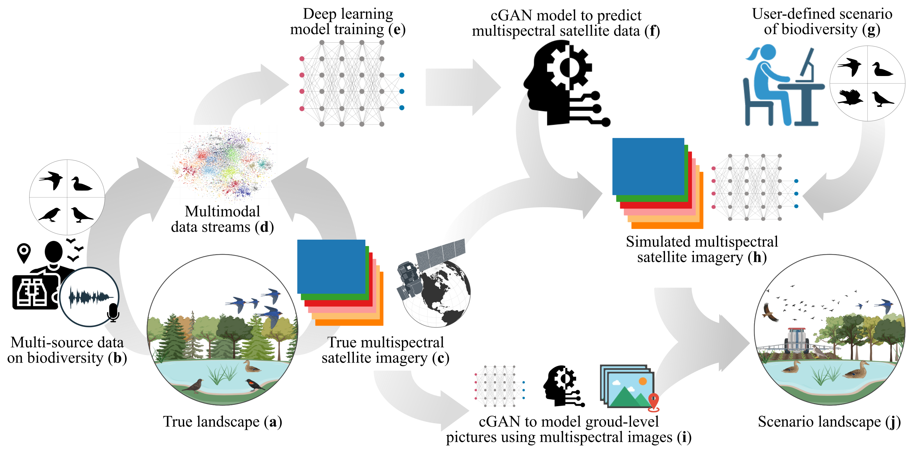

# BioViewPoint
Welcome to the BioViewPoint repository, part of the Environmental Data Science Innovation and Inclusion Lab (ESIIL). This repository serves as the central hub for our working group, hosting our project description, proposals, member bios, codebase, and more.

## Our Project

  Satellites are a powerful tool to understand how the world is changing. Satellites equipped with cameras, in particular, record light reflected by the Earth's surface across different wavelengths. We can use these data to understand the environmental conditions that influence the distribution of life on Earth, or Earth’s 'biodiversity'. However, just as environmental changes influence where species are and how many species exist in a particular place, species also influence their environment. In other words, biodiversity itself helps shape the world around us. This means that knowledge on how species are distributed in space and time can offer insights into our environment and on how this might change in the future. To explore this concept, our project will use a combination of species observations, pictures taken from satellites, and artificial intelligence to describe how biodiversity affects the environment. We think that just as we can use these satellite photos to understand the environment's impact on biodiversity, we can also use observations of different species to map the Earth's surface the way satellites perceive it. Through this research, we can also better understand how different species contribute to keeping their environment healthy, which will support policymakers in creating legislation to protect Earth’s biodiversity and the environments we share with them.

<figure style="text-align: center;">
  
  <figcaption>
    Biodiversity-driven simulation of satellite data. In a 'true’ landscape (a), biodiversity data (b) and multispectral satellite data (c) are combined into a single data stream (d) to train a cGAN model (e) that predicts satellite data from biodiversity data. The output model (f) then uses additional satellite data (g) and user-modified biodiversity data (h), which allows us to examine scenario landscapes (i).
  </figcaption>
</figure>
